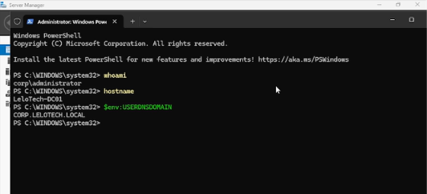
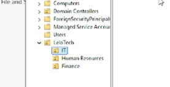
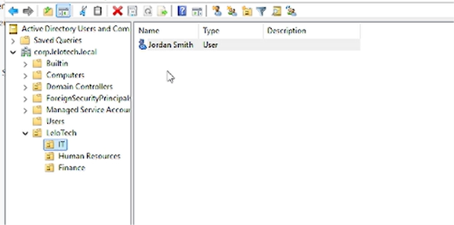
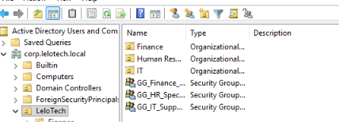
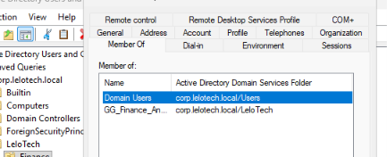
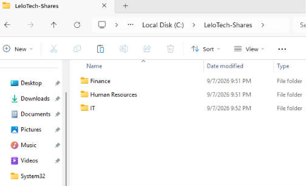
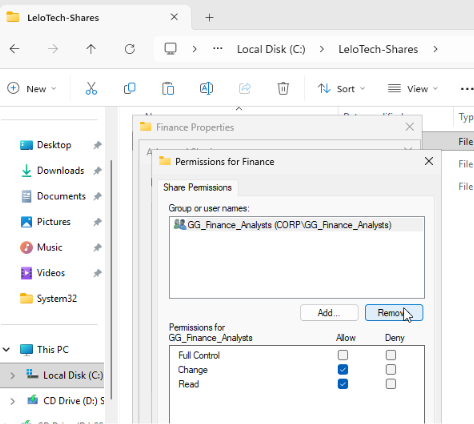
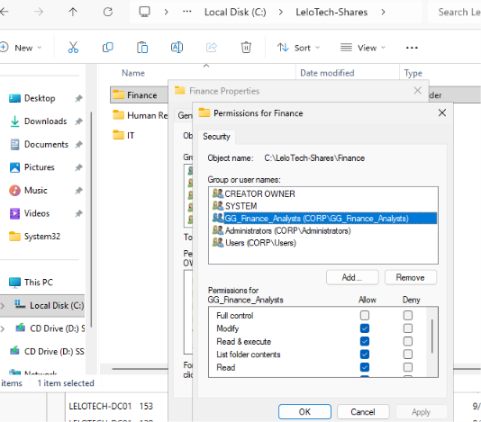

# Active Directory IAM Lab

## Objective

Essentially, this lab simulated onboarding three employees into our Active Directory domain. We divided the employees into separate Organizational Units (OUs) for better administrative structure and management. We also created role-based security groups and assigned each employee to the appropriate group based on their job role, establishing the foundation for managing access through RBAC.

## Environment & Tools

- Oracle VirtualBox
- Windows Server 2025
- Active Directory Domain Services (AD DS)
- Active Directory Users and Computers (ADUC)
- DNS
- PowerShell / Command Line
- IPv4 Networking

## Scenario
As an IAM Administrator, I'm tasked with onboarding three new employees from different departments into the LeloTech Active Directory domain. Each employee must be placed into their designated Organizational Unit (OU) based on their department for better organization and administration. I must also assign each employee to the appropriate security group based on their job role, establishing a role-based structure that can later be used to manage access to company resources.

## What I Configured

1. Verified my authenticated identity, hostname, and Active Directory domain using PowerShell commands.

2. Created an Organizational Unit (OU) structure within the LeloTech domain to organize users based on their departments.

3. Provisioned three employee accounts using Active Directory Users and Computers (ADUC) and placed each employee into their designated departmental OU.

4. Configured each employee with a temporary password and required a password change at the next logon so the administrator-created credential would not remain the employee's permanent password.

5. Created Global Security Groups based on the employees' job roles.

6. Assigned each employee to their appropriate security group to establish the identity-to-role structure for Role-Based Access Control (RBAC).

7. Verified each employee's security group assignment through the **Member Of** section in ADUC.

## IAM Concepts Demonstrated

### Organizational Units (OUs)
Organizational Units help provide better organization and administration within Active Directory. In this lab, I created separate OUs for each department and organized employees into their designated OUs based on their department. The OUs were used for administrative organization rather than directly providing access to resources.

### Security Groups
Security groups provide a more organized and scalable way of managing access. Instead of assigning permissions individually to every employee, users can be assigned to security groups based on their job roles. This creates a role-based structure that can later be used to assign permissions to company resources.

### Role-Based Access Control (RBAC)
RBAC is an access-control model where permissions are assigned based on a user's role rather than individually to each user. In this lab, I established the identity-to-role portion of RBAC by creating security groups based on job roles and assigning each employee to their designated group. These groups can later be assigned permissions to specific company resources.

### Authentication vs. Authorization
Authentication verifies the identity of a user and answers the question, "Who are you?" Authorization determines what an authenticated user is permitted to access or perform. During this lab, I verified my authenticated identity before making administrative changes and established security group memberships that can later be used when authorizing access to resources.

### Joiner-Mover-Leaver (JML)
JML represents the identity lifecycle of a user within an organization. A Joiner is a new employee whose identity and required access must be provisioned. A Mover is an existing employee whose role or responsibilities have changed and may require their access to be modified. A Leaver is an employee leaving the organization whose access must be revoked or disabled according to the organization's offboarding procedures.

This lab demonstrated the **Joiner** process by provisioning three new employee identities, placing them into their appropriate departmental OUs, and assigning them to security groups based on their newly hired roles.

## Verification

I verified my configuration by navigating to each newly added user in Active Directory Users and Computers (ADUC) and reviewing the **Member Of** tab. Seeing the designated security group listed under each user's group memberships confirmed that each employee had been assigned to the correct role-based security group.

The following group memberships were verified:

- Jordan Smith (`jsmith`) → `GG_IT_Support`
- Maya Johnson (`mjohnson`) → `GG_HR_Specialists`
- Daniel Carter (`dcarter`) → `GG_Finance_Analysts`

This verification confirmed that the identity-to-role assignments were configured correctly. Resource-level permissions were not configured or tested during this lab.

## What I Learned

Before completing this lab, I did not fully understand the Joiner-Mover-Leaver (JML) identity lifecycle or some of the tools and concepts used to establish RBAC. I was already familiar with Organizational Units (OUs) and security groups, but I did not fully understand how useful they could be for organizing and managing identities within Active Directory.

After completing this lab, I have a better understanding of the purpose behind OUs and security groups. OUs provide a structured way to organize and administer identities within a domain, while security groups provide a scalable way to organize users based on their roles and eventually manage access through group membership rather than assigning permissions individually.

I also gained hands-on experience with the Joiner portion of the JML lifecycle by provisioning new employee identities and assigning them to the appropriate OUs and security groups. One of the biggest things that stood out to me was understanding how security groups can make access management more efficient while helping reduce permission-management mistakes and unnecessary access.

## Lab Evidence

### Domain Verification
I verified my authenticated identity, server hostname, and Active Directory domain before beginning the onboarding process.

### Organizational Unit Structure
I created an OU structure within the LeloTech domain to organize identities based on their departments and support easier Active Directory administration.

### Employee Accounts
I provisioned three employee identities representing users from the IT, Human Resources, and Finance departments.

### Role-Based Security Groups
I created Global Security Groups based on employee job roles to establish the identity-to-role structure for RBAC.

### Group Membership Verification
I verified the employee's role assignment through the **Member Of** tab in ADUC, confirming that the user was successfully assigned to the appropriate security group.

# Lab 2 - RBAC File Share & Resource Permissions

## Objective

The objective of this lab was to assign permissions to security groups for the departmental resources employees need to access. The goal was to determine the appropriate level of access for each group based on the employees' roles and responsibilities while following the principle of least privilege.

## Scenario

After creating the employee accounts and role-based security groups in Lab 1, the security groups still needed to be connected to actual organizational resources. I created a shared folder containing separate departmental folders for Finance, Human Resources, and IT. I then configured Share and NTFS permissions for each folder using the appropriate departmental security group.

## What I Configured

I created departmental shared folders for Finance, Human Resources, and IT and assigned each department's security group permissions to its corresponding resource.

- GG_Finance_Analysts → Finance
- GG_HR_Specialists → Human Resources
- GG_IT_Support → IT

Each security group was granted Change and Read permissions at the Share level and Modify permissions at the NTFS level. This allows employees to read, create, modify, and delete files needed for their roles without giving them unnecessary administrative control over the resource.

Full Control was not assigned because the departmental roles did not require the ability to manage permissions. This follows the principle of least privilege by providing users only the access necessary to perform their job responsibilities.

## Why Security Groups Were Used

Permissions were assigned to departmental security groups rather than directly to individual user accounts. This makes access easier to manage and reduces the time required to provision new employees.

For example, when a new Finance employee joins the organization, the administrator can add the employee to GG_Finance_Analysts. Because the group already has the appropriate permissions to the Finance resource, the employee receives access through their group membership without requiring individual folder permissions to be configured.

This provides a more scalable and manageable approach to access control.

## Verification

I verified that all three departmental security groups were properly configured with the intended Share and NTFS permissions by reviewing the Sharing and Security settings for each departmental folder.

The following group-to-resource assignments were verified:

- GG_Finance_Analysts → Finance
- GG_HR_Specialists → Human Resources
- GG_IT_Support → IT

Each group was configured with Change and Read permissions at the Share level and Modify permissions at the NTFS level.

Effective user access has not yet been tested. A future phase of the lab will use a domain-joined client workstation to sign in as individual employees and verify that authorized resources can be accessed while unauthorized departmental resources are denied.

## What I Learned

Before this lab, I did not fully understand how users and groups are permitted to access specific resources within an organization. Now I better understand the flow of RBAC, the difference between Share and NTFS permissions, and the principle of least privilege.

The most important thing I learned about RBAC and least privilege is that permissions should be based on the capabilities a user needs to perform their job responsibilities. Users should receive enough access to complete their duties without being given unnecessary administrative capabilities or permissions.

