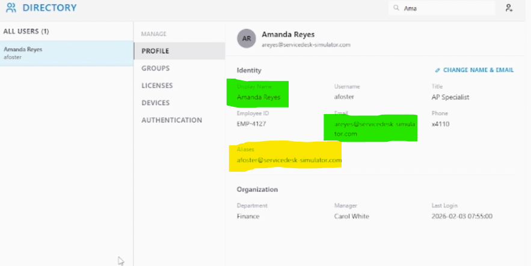

# HD-001 | Legal Name Change After Marriage

## Overview

A Finance department employee submitted a request to update her account following a legal name change after marriage. The request required updating her display name, assigning a new primary email address, and retaining her previous email address as an alias to ensure uninterrupted communication.

---

## Objective

Complete the requested account updates while maintaining business continuity and verifying that all requested changes were successfully applied.

---

## Ticket Information

| Field | Value |
|--------|-------|
| Category | Account Management |
| Department | Finance |
| Priority | Low |
| Status | ✅ Resolved |

---

## User Request

**Current Name:** Amanda Foster

**New Legal Name:** Amanda Reyes

**Requested Changes**

- Update display name
- Update primary email address to `areyes@servicedesk-simulator.com`
- Retain `afoster@servicedesk-simulator.com` as an email alias
- HR has already approved the legal name change

---

## Analysis

Before making any account changes, I reviewed the request to determine exactly what modifications were required.

### Requirements Identified

- Update the display name
- Update the primary email address
- Configure the previous email address as an alias
- Verify the completed changes

Since HR had already approved and updated the employee records, the identity verification step had already been completed.

---

## Resolution

Completed the following actions:

- Updated the user's display name to **Amanda Reyes**
- Updated the primary email address to **areyes@servicedesk-simulator.com**
- Retained **afoster@servicedesk-simulator.com** as an email alias

---

## Verification

Verified that:

- The display name reflects the user's legal name
- The primary email address was successfully updated
- The previous email address remains functional as an alias

---

## Skills Demonstrated

- Account Management
- Identity Management
- User Verification
- Technical Documentation
- Customer Communication
- Microsoft 365 Administration

---

## Lessons Learned

- Legal name changes often require multiple account updates rather than a single modification.
- Email aliases help maintain communication during account transitions.
- Verifying administrative requests before making changes helps ensure account integrity.

---

##  Next Improvements

In a production environment I would also:

- Verify the user can successfully sign in.
- Confirm email delivery to both the new and alias addresses.
- Document the completed work in the ticketing system.
- Notify the user that the request has been completed.

---

## 📷 Screenshots

### Original Ticket

### Display Name Change

### Updated Account

